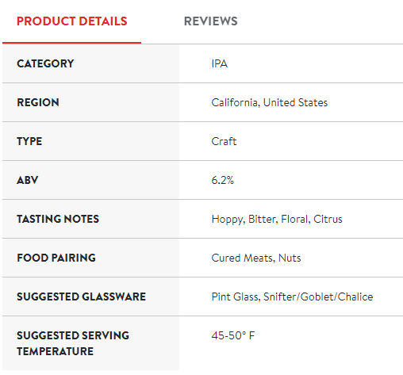

# Drizly Web Crawler

Beers' characteristics Web Crawler. Extracting from [Drizly](https://drizly.com/) website.

## Intro
This project was developed only for education purposes.

Its main goal is to retrieve the beers characteristics, given a certain beer style. It crawls all the beers in all pages until it reaches the end.



## Setup
```
# Create python venv
python3.7 -m venv .venv

# Linux
source .venv/bin/activate

# Windows
.venv\Scripts\activate

pip install -r requirements.txt
```

## Running the Crawler

To run the crawler it's mandatory to pass the category's endpoint as an argument to the python script. An example is shown below:

```python
python .\drizly_crawler.py /beer/ale/ipa/c15
```

In this example, the seed of the crawler will be the `https://drizly.com/beer/ale/ipa/c15` page. When the end of the page is reached, it jumps to the next page and all the crawling process runs again, until all the pages for this beer style are crawled.